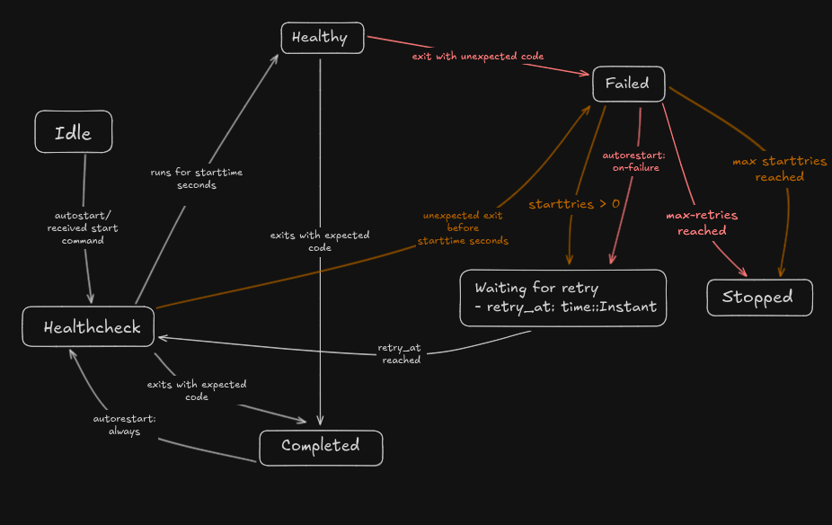

# taskmaster
Job control daemon inspired by [supervisord](https://supervisord.org/index.html).

## Goal
The idea is to build a daemon, configurable to manage background jobs reliably and with customizable options. 

Its key components are:
- `taskmaster`, daemon managing the jobs.
- `taskshell`, shell communicating commands to the daemon via UNIX sockets.

## Challenges
### State Management
The first challenge was managing the state of the processes efficiently. The possible states of processes can be broken down to the following:
```rust
pub enum ProcessState {
    Idle,
    // Started attempt at <...>
    HealthCheck(time::Instant),
    Healthy,
    // Previous state: <...>
    Failed(Box<ProcessState>),
    // Retry at <...>
    WaitingForRetry(time::Instant),
    Completed,
    Stopped,
}
```
---
The states and their transition triggers can be represented as follows:


---
This lays out a rough process for decision making during daemon execution. We can easily define those states and their transitioning rules in code. 
