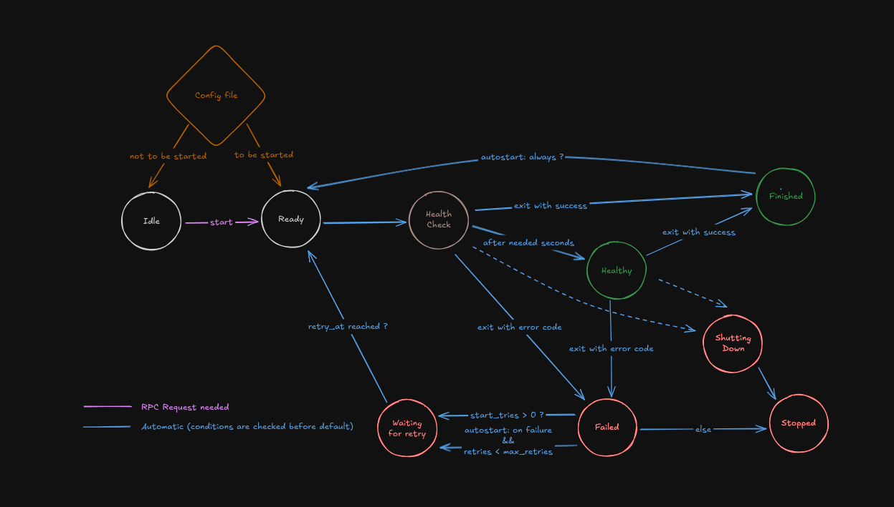

# taskmaster
A job control daemon, inspired by [supervisord](https://supervisord.org/index.html). Taskmaster manages background processes with configurable restart policies, healthchecks, and real-time monitoring.

## Overview
Taskmaster consists of three main components:
* **taskmaster** - The backend managing processes
* **taskshell** - Interactive shell for sending commands to the backend
* **taskboard** - Real-time TUI for monitoring process status

The daemon reads TOML configuration files to spawn and monitor processes, automatically restarting them based on defined policies.
Communication happens through Unix domain sockets using an adapted version of JSON-RPC 2.0.

## Features
* **Process Management** - Start, stop, restart processes with configurable retry policies
* **Health Checks** - Determine whether a process is healthy based on uptime, or a configured command (like in docker compose)
* **Real-time Communication** - Reliable Inter Process Communication
* **Hot-Reload** - Update process configurations without restarting the daemon
* **Process Attachment** - Stream stdout/stderr from running processes in real-time
* **Privilege Deescalation** - Deescalate into a different user when spawning processes
* **JSON Logs** - taskmaster logs are easy to look up by process name, event type, log level, ...

## Architecture
The core of taskmaster is a finite state machine that models process lifecycles. Each process moves through well-defined states with clear transition rules.


### Dual State Processing
The state machine operates on two dimensions:
1. **Monitor States** - React to external events (process exits, timeouts, health check results)
2. **Desired States** - Handle user commands and policy decisions
This separation allows to handle complex scenarios like a user requesting a restart while a process is failing health checks by applying the same rules as for monitoring, making the state machine fully self-contained.
This ensures we processes cannot enter invalid states and proviedes predictable behavior.

## Example Configuration
```toml
[processes.nginx]
cmd = "/usr/sbin/nginx"
user = "www"                     # Deescalate into www user
workingdir = "/var/www"
autostart = true                 # Spawn process automatically when taskmaster is started
autorestart = "on-failure[:5]"   # Retry 5 times before giving up   
stdout = "/var/log/nginx.stdout"
stderr = "/var/log/nginx.stderr"

[processes.nginx.healthcheck]
cmd = "/usr/bin/curl"
args = ["http://localhost/health"]
timeout = 5    # Wait 5 seconds for one healthcheck before considering it failed
retries = 3    # Retry health check 5 times
```
## Usage
Start the daemon
```bash
$ cargo ts engine start config.toml
```
Send commands to the daemon using the taskshell, either interactively:
```bash
$ cargo ts
taskshell> status nginx
nginx: healthcheck since 2 seconds
taskshell> stop nginx
stopping nginx
```
or with shell commands:
```bash
$ cargo ts status nginx
nginx: stopping since 3 seconds
$ cargo ts restart nginx
restarting nginx
```
For a full explanation of the availables commands, run `cargo ts help`.
